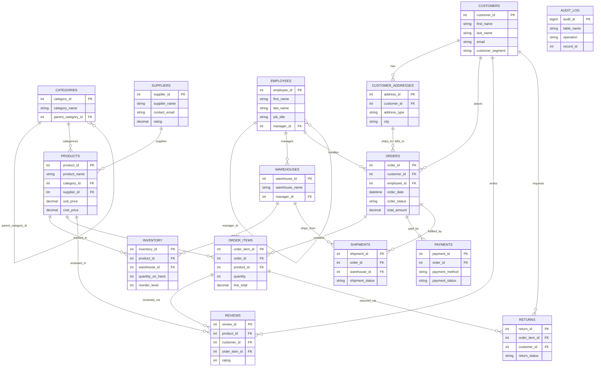

# Entity-Relationship Diagram

Renders automatically on GitHub (Mermaid support built into GitHub's Markdown viewer).

## Relationship summary

| Relationship | Cardinality | Notes |
|---|---|---|
| categories → categories | 1:M | self-referencing tree (parent/child) |
| suppliers → products | 1:M | one supplier ships many products |
| categories → products | 1:M | one category groups many products |
| employees → employees | 1:M | manager hierarchy |
| employees → warehouses | 1:M | one manager per warehouse |
| customers → customer_addresses | 1:M | multiple billing/shipping addresses |
| customers → orders | 1:M | order history |
| products / warehouses → inventory | M:N | resolved via inventory (composite unique key) |
| orders → order_items | 1:M | order line items |
| orders → payments | 1:M | supports partial/split payments |
| orders → shipments | 1:M | supports split shipments |
| order_items → reviews | 1:0..1 | review tied to a specific purchased line item |
| order_items → returns | 1:0..1 | return tied to a specific purchased line item |
